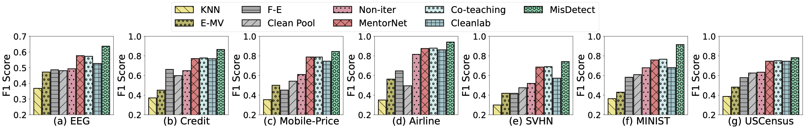
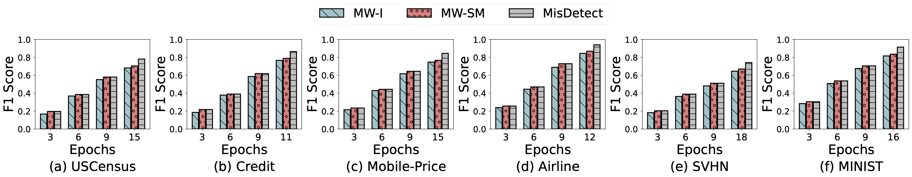

# MisDetect

This repo contains the codes for our submitted paper.
The framework of our algorithm is as follows:

     
    

Our 

We compare MisDetect against the state-of-the-art on the precision, recall and F1-score of mislabel detection. Some of the results are listed below:

     
    

     
    

# Quick Start

## Requirements
Before running the codes, please make sure the environment is set proporly according to `requirements.txt`. 
- `Python 3.7+`
- `Pytorch 1.10.1`

Different experiments can be conducted by different folder.

