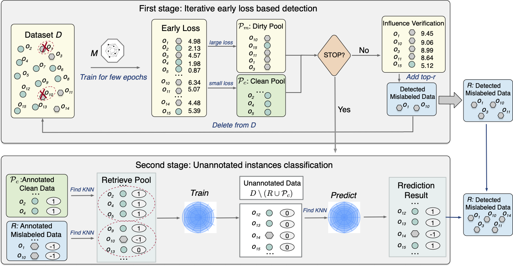
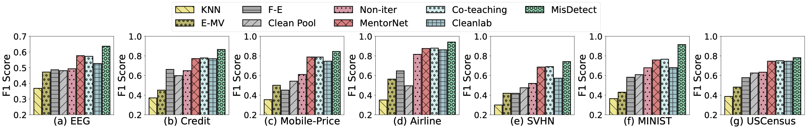
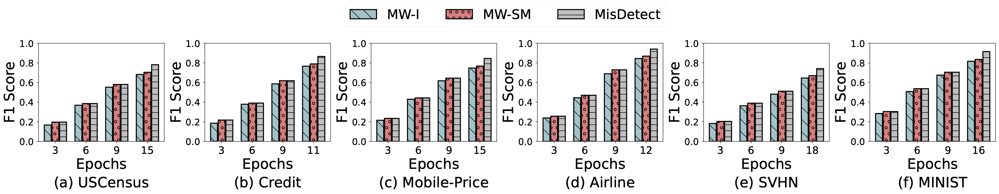

# MisDetect

This repo contains the codes for our submitted paper.
The framework of our algorithm is as follows:

     
    

We evaluate our approach on 15 real-world image and tabular datasets from diverse domains. Table below shows the statistics of the datasets.

|   **Dataset**  | **#-Items** | **#-Attributes** | **#-Classes** | **Mislabel Ratio** |             **Classifacation Task**             |
|:--------------:|:-----------:|:----------------:|:-------------:|:------------------:|:-----------------------------------------------:|
|    USCensus    |    32,561   |        14        |       2       |         5%         |      If an adult earns more than \$ 50,000.     |
|      Wine      |    6,497    |        12        |       7       |         60%        |         Different types of wine quality.        |
|     Credit     |   150,000   |        10        |       2       |       16.55%       | If a client will experience financial distress. |
|     Mobile     |    2,000    |        20        |       4       |         30%        |           The price range of a mobile.          |
|     Airline    |   103,905   |        24        |       2       |         40%        |         The airline satisfaction level.         |
|      SVHN      |   630,420   |      3X32X32     |       10      |         10%        |       Different street view house numbers.      |
|     MINIST     |    70,000   |      1X28X28     |       10      |         10%        |          Different handwritten numbers.         |
|       EEG      |    14,980   |        14        |       2       |         5%         |       If the eye-state is closed or open.       |
|    CIFAR-10    |    60,000   |      3X32X32     |       10      |         20%        |           Different universal objects.          |
|    CIFAR-100   |    60,000   |      3X32X32     |      100      |         20%        |           Different universal objects.          |
|      Heart     |     919     |        11        |       2       |         30%        |        If the patient has heart disease.        |
|      Hotel     |    36,276   |        18        |       2       |         30%        |  If a hotel booking status is canceled or not.  |
|     KMINIST    |    70,000   |      1X28X28     |       10      |         10%        |   Different types of Japanese cursive scripts.  |
| Fashion-MINIST |    70,000   |      1X28X28     |       10      |         10%        |           Different types of products.          |
|    CoverType   |   581,013   |        54        |       7       |         40%        |          Different forest cover types.          |

We compare MisDetect against the state-of-the-art on the precision, recall and F1-score of mislabel detection. Some of the results are listed below:

     
    

     
    

# Quick Start

## Folder Structure

    .
    ├── config.py                 # codes for setting parameters
    ├── utils.py                  # utility functions
    ├── main.py                   # evaluation of different methods
    ├── misdetect                  # codes of different datasets(tabular or image):multi-class mislabel detection.
    └── requirements.txt          # requirements to run the codes

## Requirements
Before running the codes, please make sure the environment is set proporly according to `requirements.txt`. 
- `Python 3.7+`
- `Pytorch 1.7.1`
- `Cuda 10.1`

## Quick Start
Different experiments can be conducted by passing different parameters to `main.py`.
We explain some key parameters here.

> Mislabel ratio, i.e., the fraction of dataset to be fflipped as mislabeled. Although the mislabel ratio for each dataset is indicated in the table above, we still provide the mislabel ratio parameter, which allows users to fill in any datasets for experimentation.
>> --mis_ratio [mislabel_ratio]

For example, if you want to select a dataset with a proportion of 10% mislabels, you can use `--mis_ratio 0.1`.

> Mislabel distribution, i.e., the mislabel injection methods. We provide two types of mislabel injection method——Random injection and Equal injection.More specifically, given an expected proportion (say 20%) of mislabeled instances, random injection randomly selects 20% instances from the dataset and flips each of them to a random label differ- ent from the ground truth. Equal injection instead flips the same number of instances in each class. 
>> --mis_distribution [mislabel_distribution]

For example, if you want to select a dataset with Random mislabel injection method, you can use `--mis_distribution random`.

> Number of neighbors (K) for the classification model.
>> --kNN_k [k]

There are many other parameters and we have provided detailed clarification for them, which can be found in `config.py`.
