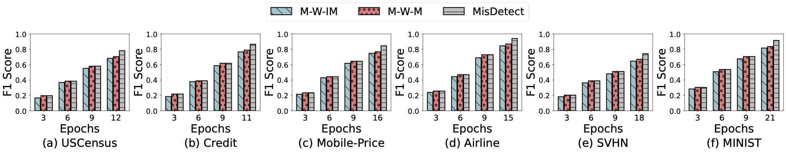

# MisDetect


This repo contains the codes for our submitted paper.
The framework of our algorithm is as follows:
<p align="center">
    <br>
    
<p>

We evaluate our approach on 15 real-world image and tabular datasets from diverse domains. Some the datasets(i.e., `covertype` and `svhn`) are relatively large, please further review through the [svhn](https://drive.google.com/drive/folders/1aQ7Koyj1YOQXeKRc4nX536ZdRmowvrWF?usp=drive_link) and [covertype](https://drive.google.com/drive/folders/1oI8qWQqiReJNeyvyR8b9iGsGB_kyt0WM?usp=drive_link). If you want to conduct relevant experiments on these two datasets, please click on the corresponding link and download it to the `/dataset/` folder. <a href = "#-table_dataset">table_datasets</a> below shows the statistics of the datasets.

<div id="-table_dataset"></div> 

|   **Dataset**  | **#-Items** | **#-Attributes** | **#-Classes** | **Mislabel Ratio** |             **Classifacation Task**             |
|:--------------:|:-----------:|:----------------:|:-------------:|:------------------:|:-----------------------------------------------:|
|    USCensus    |    32,561   |        14        |       2       |         5%         |      If an adult earns more than \$ 50,000.     |
|      Wine      |    6,497    |        12        |       7       |         60%        |         Different types of wine quality.        |
|     Credit     |   150,000   |        10        |       2       |       16.55%       | If a client will experience financial distress. |
|     Mobile     |    2,000    |        20        |       4       |         30%        |           The price range of a mobile.          |
|     Airline    |   103,905   |        24        |       2       |         40%        |         The airline satisfaction level.         |
|      SVHN      |   630,420   |      3X32X32     |       10      |         10%        |       Different street view house numbers.      |
|     MINIST     |    70,000   |      1X28X28     |       10      |         10%        |          Different handwritten numbers.         |
|       EEG      |    14,980   |        14        |       2       |         5%         |       If the eye-state is closed or open.       |
|    CIFAR-10    |    60,000   |      3X32X32     |       10      |         20%        |           Different universal objects.          |
|    CIFAR-100   |    60,000   |      3X32X32     |      100      |         20%        |           Different universal objects.          |
|      Heart     |     919     |        11        |       2       |         30%        |        If the patient has heart disease.        |
|      Hotel     |    36,276   |        18        |       2       |         30%        |  If a hotel booking status is canceled or not.  |
|     KMINIST    |    70,000   |      1X28X28     |       10      |         10%        |   Different types of Japanese cursive scripts.  |
| Fashion-MINIST |    70,000   |      1X28X28     |       10      |         10%        |           Different types of products.          |
|    CoverType   |   581,013   |        54        |       7       |         40%        |          Different forest cover types.          |

We compare MisDetect against the state-of-the-art on the precision, recall and F1-score of mislabel detection. Some of the results are listed below:
<div id="-result1"></div> 
<p align="center">
    <br>
    
<p>
<div id="-result2"></div> 
<p align="center">
    <br>
    
<p>

# Quick Start

## Folder Structure
    ├── misdetect                 # codes of different datasets(tabular or image):multi-class mislabel detection.
        ├── image-misdetect          
            ├── get_data_image.py                  # load dataset and inject mislabels
            ├── utils.py                  # utility functions
            ├── main.py                   # evaluation of different methods
            ├── model.py                   # Design the model and set model parameters 

        ├── tabular-misdetect          
            ├── get_data_tabular.py                  # load dataset and inject mislabels
            ├── utils.py                  # utility functions
            ├── main.py                   # evaluation of different methods
            ├── model.py                   # eDesign the model and set model parameters
    ├── dataset
        ├── EEG          
            ├── eeg.csv                  # Original EEG CSV dataset
            ├── eeg_normalize.csv                  # Preprocessed EEG CSV dataset
        ├── mobile          
            ├── mobile.csv                  # Original mobile_price CSV dataset
            ├── mobile_normalize.csv                  # Preprocessed mobile_price CSV dataset
        ├── wine          
            ├── wine.csv                  # Original wine quality CSV dataset
            ├── wine_normalize.csv                  # Preprocessed wine quality CSV dataset
        ├── hotel          
            ├── hotel.csv                  # Original hotel reservation CSV dataset
            ├── hotel_normalize.csv                  # Preprocessed hotel reservation CSV dataset
        ├── heart          
            ├── heart.csv                  # Original heart CSV dataset
            ├── heart_normalize.csv                  # Preprocessed heart CSV dataset
        ├── uscensus          
            ├── uscensus.csv                  # Original uscensus CSV dataset
            ├── uscensus_normalize.csv                  # Preprocessed uscensus CSV dataset
        ├── airline          
            ├── airline.csv                  # Original airline CSV dataset
            ├── airline_normalize.csv                  # Preprocessed airline CSV dataset
        ├── covertype          
            ├── covertype.csv                  # Original covertype CSV dataset
            ├── covertype_normalize.csv                  # Preprocessed covertype CSV dataset
        ├── credit          
            ├── credit.csv                  # Original credit CSV dataset
            ├── credit_normalize.csv                  # Preprocessed credit CSV dataset
        ├── cifar-10-batches-py          # CIFAR10 dataset
        ├── cifar-100-python          # CIFAR100 dataset
        ├── MNIST          # MNIST dataset
        ├── KMNIST          # KMNIST dataset
        ├── FashionMNIST          # Fashion-MNIST dataset
        ├── svhn          # svhn dataset
    └── requirements.txt          # requirements to run the codes
    └── misdetect.pdf          # Our original paper on mislabel detection
    └── README.md          


## Requirements
Before running the codes, please make sure the environment is set proporly according to `requirements.txt`. 
- `Python 3.7+`
- `Pytorch 1.7.1`
- `Cuda 10.1`


## Quick Start
Different experiments can be conducted by passing different parameters to `main.py` both for image dataset and tabular dataset.
We explain some key parameters here.


> Mislabel ratio, i.e., the fraction of dataset to be flipped as mislabeled. Although the mislabel ratio for each dataset is indicated in the table above, we still provide the mislabel ratio parameter, which allows users to fill in any datasets for experimentation.
>> --mis_ratio [mislabel_ratio]

For example, if you want to select a dataset with a proportion of 10% mislabels, you can use `--mislabel_ratio 0.1`.


> Mislabel distribution, i.e., the mislabel injection methods. We provide two types of mislabel injection method——Random injection and Equal injection.More specifically, given an expected proportion (say 20%) of mislabeled instances, random injection randomly selects 20% instances from the dataset and flips each of them to a random label differ- ent from the ground truth. Equal injection instead flips the same number of instances in each class. 
>> --mis_distribution [mislabel_distribution]

For example, if you want to select a dataset with Random mislabel injection method, you can use `--mislabel_distribution equal`.


> Dataset, i.e., specify the dataset you want to conduct the experiment on. We provide a total of 15 different datasets, as showns in tha <a href = "#-table_dataset">table_datasets</a> above, We evaluate our approach on 15 real-world image and tabular datasets from diverse domains. The size of the datasets varies from the magnitude of 102 to 106. The number of classes in each dataset ranges from 2 to 100.
>> --dataset [dataset]

For example, if you want to conduct an expriment on MNIST dataset, you can use `--dataset mnist`.

> Method, i.e., specify the method you want to conduct the experiment on. We compare misdetect against 10 different methods, including existing works and the variants of our own approach. Details are shown in <a href = "#-Method">table_methods</a> below.
>> --dataset [dataset]

For example, if you want to conduct our misdatect method, you can use `--method misdatect`.

<div id="-Method"></div> 

|   **Method**  | **Description** |
|:--------------:|:-----------:|
|    K-Nearest Neighbor(KNN)    |    Given an instance, if it has the same label with the majority of its 𝐾 nearest neighbors, it is considered to be clean. Otherwise, it is mislabeled. We vary 𝐾 from 1 to 30 and report the best result.  |  
|      Ensemble-based method via majority vote(E-MV)      |    It ensembles multiple independent classifiers with majority vote. An instance will be marked as mislabeled if the prediction is different from its label.    |      
|     Forgetting Events(F-E)     |   It identifies mislabeled instances if their prediction results vary frequently during training.   |      
|     Clean Pool | It uses P𝑐 to train a classification model and then predicts each instance in 𝐷. An instance will be considered as mislabeled if the prediction is inconsistent with its label.      |      
|     MentorNet | It is a reweighting-based robust learning method. The key idea is to use MentorNet to produce a smaller weight for potentially mislabeled instances and a higher weight for the clean. We train the robust model over 𝐷 and then mark the mis-classified training instances as mislabeled.    |    
|      Co-teaching  | As discussed in the related work section, Co-teaching is a classical robust learning method. Similar to MentorNet, we use the robust model trained by Co-teaching to detect mislabels as the training instances misclassified by the model.      |  
|     Cleanlab | It uses confident learning to distinguish mislabeled instances and clean ones, which implements a Python library to detect mislabels. It takes as input 𝐷 as well as an ML model. For the model, we use the same type as ours for a fair comparison.  |     
|       Non-iter |  It is a baseline that trains only one iteration and then uses early loss to detect mislabels.   |    
|    MisDetect Without Influence and Classification Model (M-W-IM) | It is a variation of our method that only uses early loss to detect mislabels, while disables the influence-based verification and classification model.  |     
|    MisDetect Without Classification Model(M-W-M)| It is another variation that uses early loss and influence-based verification while disabling the classification model   |    
|      MisDetect | It is our full-fledged solution     |       

## Cammands

### Image Dataset
For image dataset, you need to first enter the `/misdetect/image-misdetect` folder:
```
cd misdetect/image-misdetect
```
The following commands will run the baselines **K-Nearest Neighbor(KNN)**, **Ensemble-based method via majority vote(E-MV)**, **Forgetting Events(F-E)**, **Clean Pool**, **MentorNet**, **Co-teaching**, **Cleanlab**, **Non-iter**, **MisDetect Without Influence and Classification Model (M-W-IM)**, **MisDetect Without Classification Model(M-W-M)** and our algorithm **MisDetect** on the dataset `mnist`. While running these commands, you can also adjust the proportion of mislabel data you want to experiment with (such as from `0.1` to `0.4`), the distribution of mislabel data (i.e. `random` and `equal`).
```
python main.py mnist 0.3 equal misdetect
python main.py mnist 0.3 equal knn
python main.py mnist 0.3 equal clean_pool
python main.py mnist 0.3 equal cleanlab
python main.py mnist 0.3 equal forget_event
python main.py mnist 0.3 equal ensemble
python main.py mnist 0.3 equal coteaching
python main.py mnist 0.3 equal mentornet
python main.py mnist 0.3 equal non_iter
python main.py mnist 0.3 equal M_W_IM
python main.py mnist 0.3 equal M_W_M
```
If you need to run the algorithms on other dataset, simply change the dataset name `mnist` into other names such as `cifar10`, `cifar100`, `kmnist`, `fashion-mnist` and `svhn`.

### Tabular Dataset
For tabular dataset, you need to first enter the `/misdetect/tabular-misdetect` folder:
```
cd misdetect/tabular-misdetect
```
The following commands will run the baselines **K-Nearest Neighbor(KNN)**, **Ensemble-based method via majority vote(E-MV)**, **Forgetting Events(F-E)**, **Clean Pool**, **MentorNet**, **Co-teaching**, **Cleanlab**, **Non-iter**, **MisDetect Without Influence and Classification Model (M-W-IM)**, **MisDetect Without Classification Model(M-W-M)** and our algorithm **MisDetect** on the dataset `covertype`. While running these commands, you can also adjust the proportion of mislabel data you want to experiment with (such as from `0.1` to `0.4`), the distribution of mislabel data (i.e. `random` and `equal`),
```
python main.py covertype 0.3 equal misdetect
python main.py covertype 0.3 equal knn
python main.py covertype 0.3 equal clean_pool
python main.py covertype 0.3 equal cleanlab
python main.py covertype 0.3 equal forget_event
python main.py covertype 0.3 equal ensemble
python main.py covertype 0.3 equal coteaching
python main.py covertype 0.3 equal mentornet
python main.py covertype 0.3 equal non_iter
python main.py covertype 0.3 equal M_W_IM
python main.py covertype 0.3 equal M_W_M
```
If you need to run the algorithms on other dataset, simply change the dataset name `covertype` into other names such as `uscensus`, `credit`, `airline`, `mobile`, `heart`, `eeg`, `wine` and `hotel`.

To simplify the above process, we have designed a command that can run all the algorithms at once and obtain corresponding results. 
#### Image Dataset
```
cd misdetect/image-misdetect
python main.py mnist 0.3 equal all_methods
```

#### Tabular Dataset
```
cd misdetect/tabular-misdetect
python main.py covertype 0.3 equal all_methods
```
As shown in <a href = "#-result1">result1</a> and <a href = "#-result2">result2</a>. For each algorithm, we repeat the experiment 10 times and use the average of the 10 different experimental results as the final output result. 